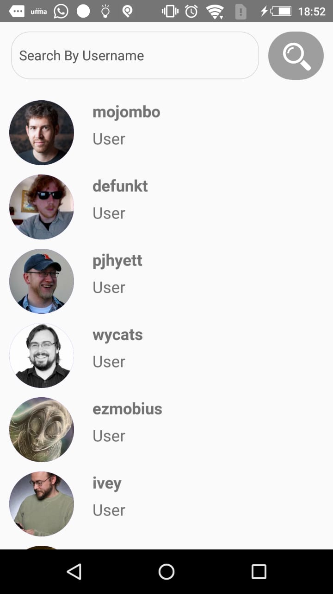
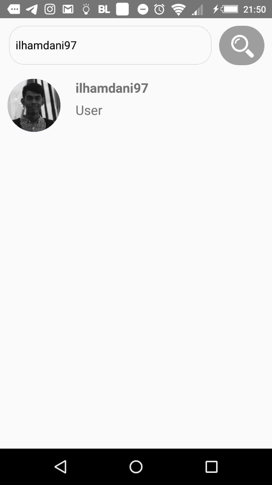

## Important 

This project is still on very early development stage. If you want to use for production, use it with your own risk.
<br>More feature Coming Really Soon.


## Screenshots

<p float="left">
  
  
</p>

## Fitures

- List User
- Search User By Username

## Tech Stack

- React Native 
- Redux

## Prerequisites

- Make sure You had been install NodeJs in your system [https://nodejs.org/](https://nodejs.org/)
- Then install React Native [https://facebook.github.io/react-native/](https://facebook.github.io/react-native/)
- Dont forget express ad the backend [https://expressjs.com/](https://expressjs.com/)

## Installation & Configuration

follow these steps to install

### Frontend

```bash
git clone https://github.com/ilhamdani97/listUserGithub.git
cd listUserGithub
npm install
npm start
react-native run-ios #for ios
react-native run-android #for android
```

create .env file and set API_HOST as your expressUri

```env
API_URL=http://YOUR_DOMAIN:YOUR_PORT
```


### Support Us :)

- Stars this repository
- Hire Us

  * [Ilham Ramadani](https://www.linkedin.com/in/ilham-ramadani-a38256117/)
  ## Contact

- WA/TELEGRAM: +62 1372374345 (Ilham Ramadani)

## Download App (Demo usage only)
